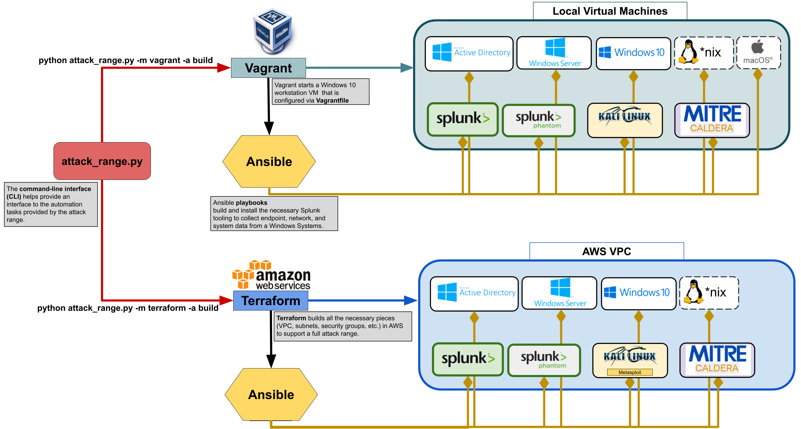
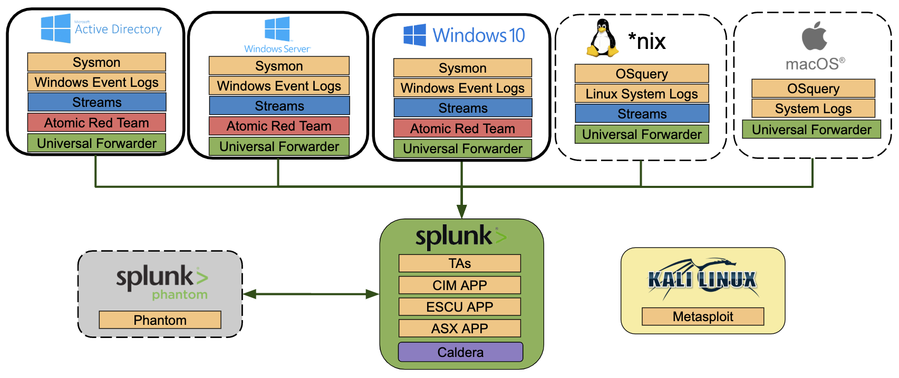

# Splunk Attack Range

## Purpose
The Attack Range solves two main challenges in development of detections. First, it allows the user to quickly build a small lab infrastructure as close as possible to your production environment. This lab infrastructure contains a Windows Domain Controller, Windows Server, Windows Workstation and a Kali Machine, which comes pre-configured with multiple security tools and logging configuration. The infrastructure comes with a Splunk server collecting multiple log sources from the different servers.  

Second, this framework allows the user to perform attack simulation using different engines. Therefore, the user can repeatedly replicate and generate data as close to "ground truth" as possible, in a format that allows the creation of detections, investigations, knowledge objects, and playbooks in Splunk.

## Demo
[:tv: A short demo (< 6 min)](https://www.youtube.com/watch?v=xIbln7OQ-Ak) which shows the basic functions of the attack range. It builds a testing enviroment using terraform, walks through the data collected by Splunk. Then attacks it using MITRE ATT&CK Technique [T1003](https://attack.mitre.org/techniques/T1003/) and finally showcases how [ESCU](https://github.com/splunk/security-content) searches are used to detect the attack.

[](https://www.youtube.com/watch?v=xIbln7OQ-Ak)

## Deployment

Attack Range can be built in three different ways:

- **local** using vagrant and virtualbox
- in the **cloud** using terraform and AWS
- **cloud optimized** using terraform, packer and AWS



## Architecture

Attack Range consists of:

- Windows Domain Controller
- Windows Server
- Windows Workstation
- A Kali Machine
- Splunk Server

Which can be added/removed/configured using [attack_range.conf](attack_range.conf). More machines such as Phantom, Linux server, Linux client, MacOS clients are currently under development.



## Configuration
- local [Vagrant and Virtualbox](https://github.com/splunk/attack_range/wiki/Configure-Attack-Range-for-Vagrant)
- cloud [Terraform and AWS](https://github.com/splunk/attack_range/wiki/Configure-Attack-Range-for-Terraform)
- cloud optimized [Packer + Terraform and AWS](https://github.com/splunk/attack_range/wiki/Configure-Attack-Range-for-Packer)

## Running
Attack Range supports different actions:
- Build Attack Range
- Perform Attack Simulation
- Search with Attack Range
- Destroy Attack Range
- Stop Attack Range
- Resume Attack Range

### Build Attack Range
- Build Attack Range
```
python attack_range.py -m terraform/vagrant/packer -a build
```

### Perform Attack Simulation
- Perform Attack Simulation
```
python attack_range.py -m terraform/vagrant/packer -a simulate -st T1117,T1003 -t attack-range-windows-domain-controller
```

### Search with Attack Range
- Run a savedsearch and return the results
```
python attack_range.py -m terraform/vagrant/packer -a search -sn search_name
```

### Destroy Attack Range
- Destroy Attack Range
```
python attack_range.py -m terraform/vagrant/packer -a destroy
```

### Stop Attack Range
- Stop Attack Range
```
python attack_range.py -m terraform/vagrant/packer -a stop
```

### Resume Attack Range
- Resume Attack Range
```
python attack_range.py -m terraform/vagrant/packer -a resume
```

## Features
- [Splunk Server](https://github.com/splunk/attack_range/wiki/Splunk-Server)
  * Indexing of Microsoft Event Logs, PowerShell Logs, Sysmon Logs, DNS Logs, ...
  * Preconfigured with multiple TAs for field extractions
  * Out of the box Splunk detections with Enterprise Security Content Update ([ESCU](https://splunkbase.splunk.com/app/3449/)) App
  * Preinstalled Machine Learning Toolkit ([MLTK](https://splunkbase.splunk.com/app/2890/))
  * Splunk UI available through port 8000 with user admin
  * ssh connection over configured ssh key

- [Splunk Enterprise Security](https://splunkbase.splunk.com/app/263/)
  * [Splunk Enterprise Security](https://splunkbase.splunk.com/app/263/) is a premium security solution requiring a paid license.
  * Enable or disable [Splunk Enterprise Security](https://splunkbase.splunk.com/app/263/) in [attack_range.conf](attack_range.conf)
  * Purchase a license, download it and store it in the apps folder to use it.

- [Splunk Phantom](https://www.splunk.com/en_us/software/splunk-security-orchestration-and-automation.html)
  * [Splunk Phantom](https://www.splunk.com/en_us/software/splunk-security-orchestration-and-automation.html) is a Security Orchestration and Automation platform
  * For a free development license (100 actions per day) register [here](https://my.phantom.us/login/?next=/)
  * Enable or disable [Splunk Phantom](https://www.splunk.com/en_us/software/splunk-security-orchestration-and-automation.html) in [attack_range.conf](attack_range.conf)

- [Windows Domain Controller & Window Server & Windows 10 Client](https://github.com/splunk/attack_range/wiki/Windows-Infrastructure)
  * Can be enabled, disabled and configured over [attack_range.conf](attack_range.conf)
  * Collecting of Microsoft Event Logs, PowerShell Logs, Sysmon Logs, DNS Logs, ...
  * Sysmon log collection with customizable Sysmon configuration
  * RDP connection over port 3389 with user Administrator

- [Atomic Red Team](https://github.com/redcanaryco/atomic-red-team)
  * Attack Simulation with [Atomic Red Team](https://github.com/redcanaryco/atomic-red-team)
  * Will be automatically installed on target during first execution of simulate

- [Caldera](https://github.com/mitre/caldera)
  * Adversary Emulation with [Caldera](https://github.com/mitre/caldera)
  * Installed on the Splunk Server and available over port 8888 with user admin
  * Preinstalled Caldera agents on windows machines

- [Kali Linux](https://www.kali.org/)
  * Preconfigured Kali Linux machine for penetration testing
  * ssh connection over configured ssh key


## Planned features
- Linux Server
- Linux Client
- macOS Client


## Support
Please use the [GitHub issue tracker](https://github.com/splunk/attack_range/issues) to submit bugs or request features.

If you have questions or need support, you can:

* Post a question to [Splunk Answers](http://answers.splunk.com)
* Join the [#security-research](https://splunk-usergroups.slack.com/messages/C1RH09ERM/) room in the [Splunk Slack channel](http://splunk-usergroups.slack.com)
* If you are a Splunk Enterprise customer with a valid support entitlement contract and have a Splunk-related question, you can also open a support case on the https://www.splunk.com/ support portal


## Author
* [Jose Hernandez](https://twitter.com/d1vious)
* [Patrick Bareiß](https://twitter.com/bareiss_patrick)

## Contributors
* [Bhavin Patel](https://twitter.com/hackpsy)
* [Rod Soto](https://twitter.com/rodsoto)
* Russ Nolen
* Phil Royer
* [Joseph Zadeh](https://twitter.com/JosephZadeh)

## Contributing
We welcome feedback and contributions from the community! Please see our [contribution guidelines](docs/CONTRIBUTING.md) for more information on how to get involved.
