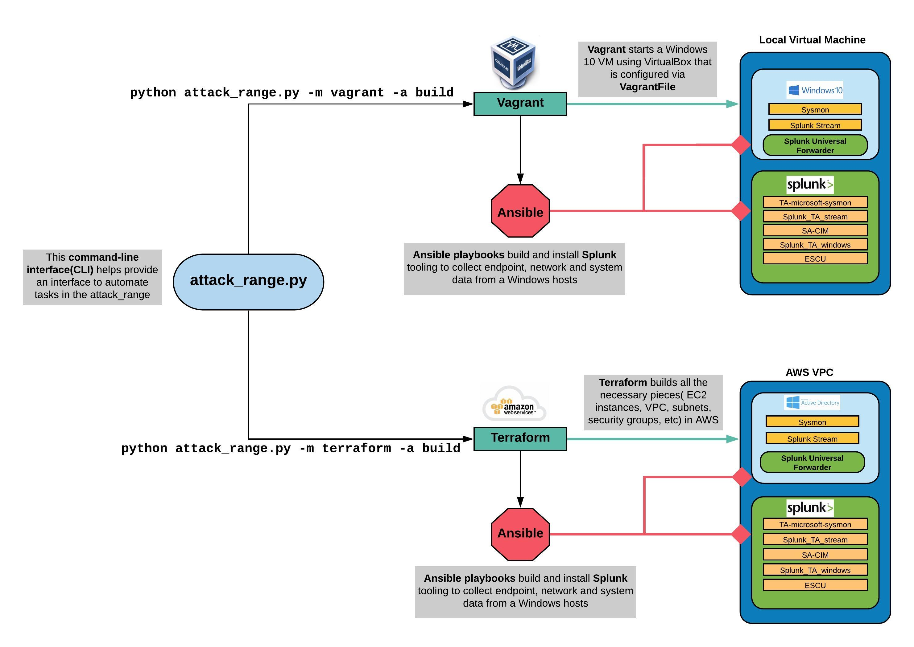

# Splunk Attack Range

## Purpose
The Attack Range solves two main challenges in development of detections. First, it allows the user to quickly build a small lab infrastructure as close as possible to your production environment. This lab infrastructure contains a Windows Domain Controller, Windows Server, Windows Workstation and a Kali Machine, which comes pre-configured with multiple security tools and logging configuration. The infrastructure comes with a Splunk server collecting multiple log sources from the different servers.  

Second, this framework allows the user to perform attack simulation using different engines. Therefore, the user can repeatedly replicate and generate data as close to "ground truth" as possible, in a format that allows the creation of detections, investigations, knowledge objects, and playbooks in Splunk.

## Demo
[](https://www.youtube.com/watch?v=xIbln7OQ-Ak)

## Architecture
Attack Range can be built in three different ways:
- **local** using vagrant and virtualbox
- in the **cloud** using terraform and AWS
- **cloud optimized** using terraform, packer and AWS



Attack Range consists of Windows Domain Controller, Windows Server, Windows Workstation and a Kali Machine, which can be added/removed/configured using attack_range.conf. More machines such as Phantom, Linux Server, Linux Client are currently under development.


## Configuration
- local [Vagrant and Virtualbox](https://github.com/splunk/attack_range/wiki/Configure-Attack-Range-for-Vagrant)
- cloud [Terraform and AWS](https://github.com/splunk/attack_range/wiki/Configure-Attack-Range-for-Terraform)
- cloud optimized [Packer + Terraform and AWS](https://github.com/splunk/attack_range/wiki/Configure-Attack-Range-for-Packer)

## Running
Attack Range supports different actions:
- Build Attack Range
- Perform Attack Simulation
- Search with Attack Range
- Destroy Attack Range
- Stop Attack Range
- Resume Attack Range

### Build Attack Range
- Build Attack Range
```
python attack_range.py -m terraform/vagrant/packer -a build
```

### Perform Attack Simulation
- Perform Attack Simulation
```
python attack_range.py -m terraform/vagrant/packer -a simulate -st T1117,T1003 -t attack-range-windows-domain-controller
```

### Search with Attack Range
- Run a savedsearch and return the results
```
python attack_range.py -m terraform/vagrant/packer -a search -sn search_name
```

### Destroy Attack Range
- Destroy Attack Range
```
python attack_range.py -m terraform/vagrant/packer -a destroy
```

### Stop Attack Range
- Stop Attack Range
```
python attack_range.py -m terraform/vagrant/packer -a stop
```

### Resume Attack Range
- Resume Attack Range
```
python attack_range.py -m terraform/vagrant/packer -a resume
```


## Support
Please use the [GitHub issue tracker](https://github.com/splunk/attack_range/issues) to submit bugs or request features.

If you have questions or need support, you can:

* Post a question to [Splunk Answers](http://answers.splunk.com)
* Join the [#security-research](https://splunk-usergroups.slack.com/messages/C1RH09ERM/) room in the [Splunk Slack channel](http://splunk-usergroups.slack.com)
* If you are a Splunk Enterprise customer with a valid support entitlement contract and have a Splunk-related question, you can also open a support case on the https://www.splunk.com/ support portal


## Author
* [Jose Hernandez](https://twitter.com/d1vious)

## Contributors
* [Patrick Bareiß](https://twitter.com/bareiss_patrick)
* [Bhavin Patel](https://twitter.com/hackpsy)
* [Rod Soto](https://twitter.com/rodsoto)
* Russ Nolen
* Phil Royer
* [Joseph Zadeh](https://twitter.com/JosephZadeh)

## Contributing
We welcome feedback and contributions from the community! Please see our [contribution guidelines](docs/CONTRIBUTING.md) for more information on how to get involved.
