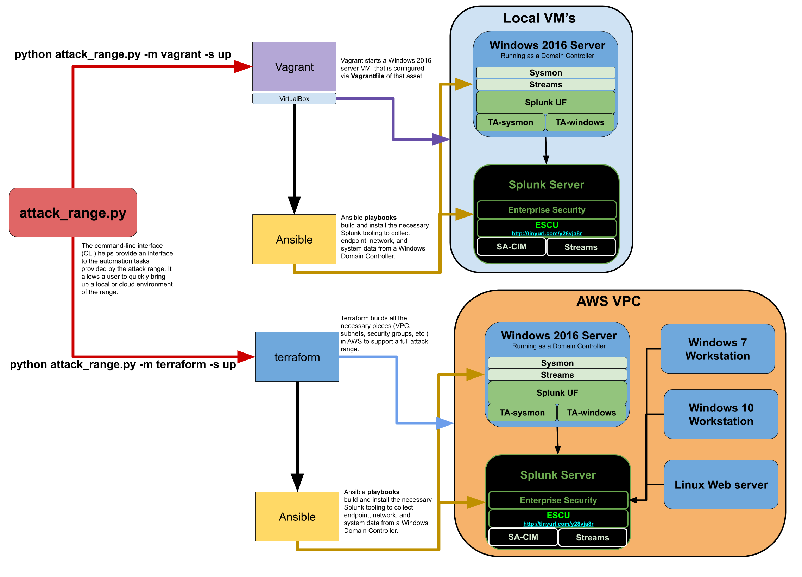

# Splunk Attack Range

## Purpose
The Attack Range solves two main challenges in development of detections. First, it allows the user to quickly build a small lab infrastructure as close as possible to your production environment. This lab infrastructure contains a Windows Domain Controller, Windows Workstation and Linux server, which comes pre-configured with multiple security tools and logging configuration. The infrastructure comes with a Splunk server collecting multiple log sources from the servers and normalizing them according to the [Common Information Model](https://docs.splunk.com/Documentation/CIM/4.14.0/User/Overview).  

Second, this framework allows the user to perform attack simulation using different engines. Therefore, the user can repeatedly replicate and generate data as close to "ground truth" as possible, in a format that allows the creation of detections, investigations, knowledge objects, and playbooks in Splunk.

The Attack Range can be used either locally using Vagrant and Virtualbox or as a full-blown cloud infrastructure in AWS using Terraform.

This project is inspired by [DetectionLab](https://github.com/clong/DetectionLab).

## Architecture
Attack Range can be executed using two different operations modes:
- local using vagrant and virtualbox
- in the cloud using terraform and AWS

In order to make Attack Range work on almost every laptop, the local version using Vagrant and Virtualbox consists of a subset of the full-blown cloud infrastructure in AWS using Terraform. The local version consists of a Splunk single instance and a Windows 10 workstation pre-configured with best practice logging configuration according to Splunk.
(diagram here)

The cloud infrastructure in AWS using Terraform consists of a Windows 10 workstation, a Windows 2016 server and a Splunk server.
(diagram here)

## Configuration
- local using vagrant and virtualbox -> link to wiki page
- cloud using terraform and AWS -> link to wiki page

## Running
In order to use Attack Range, two steps needs to be performed:
1. Build Attack Range
2. Perform Attack Simulation

### Build Attack Range

### Perform Attack Simulation

## Running

1. `git clone https://github.com/splunk/attack_range && cd attack_range` clone project and cd into the project dir
2. `virtualenv -p python3 venv && source venv/bin/activate && pip install -r requirements.txt` create virtualenv and install requirements
3. `python attack_range.py --state up --mode vagrant` start up a range locally using vagrant or `python attack_range.py --state up --mode terraform` to build one in the cloud (AWS)

See [Usage](#usage) for more options, **make sure that you [configure](#configure) the mode first**

If you are on OSX, you will have to install sshpass `brew install https://raw.githubusercontent.com/kadwanev/bigboybrew/master/Library/Formula/sshpass.rb`

## Configure

#### For Terraform
1. `brew install terraform` install Terraform CLI on OSX [other platforms](https://www.terraform.io/downloads.html)
2. `brew install awscli`  install AWS CLI on OSX otherwise see: [guide](https://docs.aws.amazon.com/cli/latest/userguide/cli-chap-install.html)
3. Get AWS API token `aws configure`
4. Set Terraform variables under [terraform/terraform.tfvars](https://github.com/splunk/attack_range/blob/develop/terraform/terraform.tfvars.example)

#### For Vagrant
1. 	`brew cask install virtualbox` if you don't already have virtual box installed on OSX, otherwise see their [installation instructions](https://www.virtualbox.org/wiki/Downloads).
2. `brew cask install vagrant` install Vagrant CLI on OSX, otherwise see: [guide](https://www.vagrantup.com/downloads.html)

#### Range Settings
To configure general range settings like your Splunk server default username, sysmon template to deploy, or Active Directory admin creds, edit: [ansible/vars/vars.yml](https://github.com/splunk/attack_range/blob/develop/ansible/vars/vars.yml.default)

## Examples
* Run ALL [atomic red team techniques](https://github.com/redcanaryco/atomic-red-team/tree/master/atomics) on windows10 locally:
`python attack_range.py -s up -m vagrant -vbox windows10 -si`

* List all the boxes available locally to test on
`python attack_range.py -s down -m vagrant -vlist`

* Run technique ID T1117 execution through Regsvr32 on windows 2016 Domain Controller in the cloud (AWS)
`python attack_range.py -s up -m terraform -si -st T1117`

* Run technique ID T1117 execution through Regsvr32 on windows 10 machine locally
`python attack_range.py -s up -m vagrant -vbox windows10 -si -st T1117`

## Developing

1. Create virtualenv and install requirements: `virtualenv -p python3 venv && source venv/bin/activate && pip install -r requirements.txt`
2. Install pre-commit hooks `pre-commit install`
3. Install Ansible on OSX `brew install ansible`

## Support
You can get help with setting up your own attack range in the [Splunk Community Slack](http://splk.it/slack) under the `#security-research` channel.

## Author
* [Jose Hernandez](https://twitter.com/d1vious)

## Contributors
* [Rod Soto](https://twitter.com/rodsoto)
* [Bhavin Patel](https://twitter.com/hackpsy)
* Russ Nolen

## To Dos
* Implement Atomic Red Team simulation engine execution
* Implement Attack IQ simulation engine execution
* Create global .conf file
