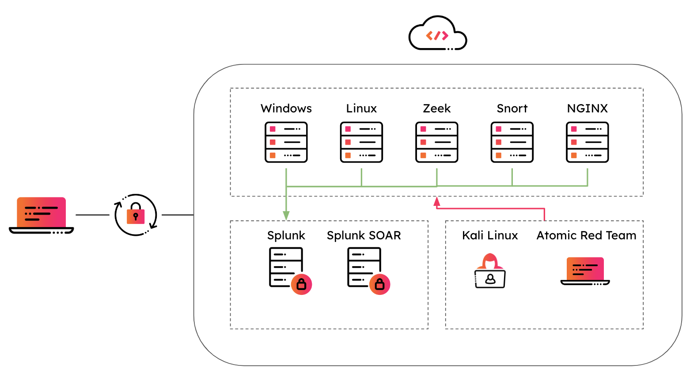

<p align="center">
    <a href="https://github.com/splunk/attack_range/releases">
        </a>
    <a href="https://github.com/splunk/attack_range/actions">
        </a>
    <a href="https://github.com/splunk/attack_range/graphs/contributors" alt="Contributors">
        </a>
    <a href="https://github.com/splunk/attack_range/stargazers">
        </a>
</p>

# Splunk Attack Range ⚔️

The Splunk Attack Range is an open-source project maintained by the Splunk Threat Research Team. It builds instrumented cloud (AWS, Azure) and local environments (Virtualbox), simulates attacks, and forwards the data into a Splunk instance. This environment can then be used to develop and test the effectiveness of detections.

## Purpose 🛡
The Attack Range is a detection development platform, which solves three main challenges in detection engineering:
* The user is able to quickly build a small lab infrastructure as close as possible to a production environment.
* The Attack Range performs attack simulation using different engines such as Atomic Red Team or Caldera in order to generate real attack data. 
* It integrates seamlessly into any Continuous Integration / Continuous Delivery (CI/CD) pipeline to automate the detection rule testing process.  

## Docs
The Attack Range Documentation can be found [here](https://attack-range.readthedocs.io/en/latest/).

## Installation 🏗

### [Using Docker](https://github.com/splunk/attack_range/wiki/Using-Docker)

Attack Range in AWS:

```
docker pull splunk/attack_range
docker run -it splunk/attack_range
aws configure
python attack_range.py configure
```

To install directly on Linux, or MacOS follow [these](https://attack-range.readthedocs.io/en/latest/Attack_Range_AWS.html#) instructions.

## Architecture 🏯


The deployment of Attack Range consists of:

- Windows Domain Controller
- Windows Server
- Windows Workstation
- A Kali Machine
- Splunk Server
- Splunk SOAR Server
- Nginx Server
- Linux Server
- Zeek Server
- Snort Server

Which can be added/removed/configured using [attack_range.yml](https://github.com/splunk/attack_range/blob/develop/attack_range.yml). 

## Logging
The following log sources are collected from the machines:

- Windows Event Logs (```index = win```)
- Sysmon Logs (```index = win```)
- Powershell Logs (```index = win```)
- Aurora EDR (```index = win```)
- Sysmon for Linux Logs (```index = unix```)
- Nginx logs (```index = proxy```)
- Network Logs with Splunk Stream (```index = main```)
- Attack Simulation Logs from Atomic Red Team and Caldera (```index = attack```)
- Zeek Logs (```index = zeek```)
- Snort Logs (```index = snort```)
- Cisco Secure Endpoint Logs (```index = cisco_secure_endpoint```)
- CrowdStrike Falcon Logs (```index = crowdstrike_falcon```)
- Carbon Black Logs (```index = carbon_black_cloud```)

## Running 🏃‍♀️
Attack Range supports different actions:

### Configure Attack Range
```
python attack_range.py configure
```

### Build Attack Range
```
python attack_range.py build
```

### Show Attack Range Infrastructure
```
python attack_range.py show
```

### Perform Attack Simulations with Atomic Red Team or PurpleSharp
```
python attack_range.py simulate -e ART -te T1003.001 -t ar-win-ar-ar-0

python attack_range.py simulate -e PurpleSharp -te T1003.001 -t ar-win-ar-ar-0
```

### Destroy Attack Range
```
python attack_range.py destroy
```

### Stop Attack Range
```
python attack_range.py stop
```

### Resume Attack Range
```
python attack_range.py resume
```

### Dump Log Data from Attack Range
```
python attack_range.py dump --file_name attack_data/dump.log --search 'index=win' --earliest 2h
```

### Replay Dumps into Attack Range Splunk Server
```
python attack_range.py replay --file_name attack_data/dump.log --source test --sourcetype test
```

## Features 💍
- [Splunk Server](https://github.com/splunk/attack_range/wiki/Splunk-Server)
  * Indexing of Microsoft Event Logs, PowerShell Logs, Sysmon Logs, DNS Logs, ...
  * Preconfigured with multiple TAs for field extractions
  * Out of the box Splunk detections with Enterprise Security Content Update ([ESCU](https://splunkbase.splunk.com/app/3449/)) App
  * Preinstalled Machine Learning Toolkit ([MLTK](https://splunkbase.splunk.com/app/2890/))
  * pre-indexed BOTS datasets
  * Splunk UI available through port 8000 with user admin
  * ssh connection over configured ssh key

- [Splunk Enterprise Security](https://splunkbase.splunk.com/app/263/)
  * [Splunk Enterprise Security](https://splunkbase.splunk.com/app/263/) is a premium security solution requiring a paid license.
  * Enable or disable [Splunk Enterprise Security](https://splunkbase.splunk.com/app/263/) in [attack_range.yml](https://github.com/splunk/attack_range/blob/develop/attack_range.yml)
  * Purchase a license, download it and store it in the apps folder to use it.

- [Splunk SOAR](https://www.splunk.com/en_us/software/splunk-security-orchestration-and-automation.html)
  * [Splunk SOAR](https://www.splunk.com/en_us/software/splunk-security-orchestration-and-automation.html) is a Security Orchestration and Automation platform
  * For a free development license (100 actions per day) register [here](https://my.phantom.us/login/?next=/)
  * Enable or disable [Splunk SOAR](https://www.splunk.com/en_us/software/splunk-security-orchestration-and-automation.html) in [attack_range.yml](https://github.com/splunk/attack_range/blob/develop/attack_range.yml)

- [Windows Domain Controller & Window Server & Windows 10 Client](https://github.com/splunk/attack_range/wiki/Windows-Infrastructure)
  * Can be enabled, disabled and configured over [attack_range.yml](https://github.com/splunk/attack_range/blob/develop/attack_range.yml)
  * Collecting of Microsoft Event Logs, PowerShell Logs, Sysmon Logs, DNS Logs, ...
  * Sysmon log collection with customizable Sysmon configuration
  * RDP connection over port 3389 with user Administrator

- [Atomic Red Team](https://github.com/redcanaryco/atomic-red-team)
  * Attack Simulation with [Atomic Red Team](https://github.com/redcanaryco/atomic-red-team)
  * Will be automatically installed on target during first execution of simulate
  * Atomic Red Team already uses the new Mitre sub-techniques

- [PurpleSharp](https://github.com/mvelazc0/PurpleSharp)
  * Native adversary simulation support with [PurpleSharp](https://github.com/mvelazc0/PurpleSharp)
  * Will be automatically downloaded on target during first execution of simulate
  * Supports two parameters **-st** for comma separated ATT&CK techniques and **-sp** for a simulation playbook

- [Kali Linux](https://www.kali.org/)
  * Preconfigured Kali Linux machine for penetration testing
  * ssh connection over configured ssh key


## Support 📞
Please use the [GitHub issue tracker](https://github.com/splunk/attack_range/issues) to submit bugs or request features.

If you have questions or need support, you can:

* Join the [#security-research](https://splunk-usergroups.slack.com/archives/C1S5BEF38) room in the [Splunk Slack channel](http://splunk-usergroups.slack.com)
* Post a question to [Splunk Answers](http://answers.splunk.com)
* If you are a Splunk Enterprise customer with a valid support entitlement contract and have a Splunk-related question, you can also open a support case on the https://www.splunk.com/ support portal

## Contributing 🥰
We welcome feedback and contributions from the community! Please see our [contribution guidelines](docs/CONTRIBUTING.md) for more information on how to get involved.

## Author
* [Jose Hernandez](https://twitter.com/_josehelps)
* [Patrick Bareiß](https://twitter.com/bareiss_patrick)

## Contributors
* [Bhavin Patel](https://twitter.com/hackpsy)
* [Rod Soto](https://twitter.com/rodsoto)
* Russ Nolen
* Phil Royer
* [Joseph Zadeh](https://twitter.com/JosephZadeh)
* Rico Valdez
* [Dimitris Lambrou](https://twitter.com/etz69)
* [Dave Herrald](https://twitter.com/daveherrald)
* Ignacio Bermudez Corrales
* Peter Gael
* Josef Kuepker
* Shannon Davis
* [Mauricio Velazco](https://twitter.com/mvelazco)
* [Teoderick Contreras](https://twitter.com/tccontre18)
* [Lou Stella](https://twitter.com/ljstella)
* [Christian Cloutier](https://github.com/ccl0utier)
* Eric McGinnis
* [Micheal Haag](https://twitter.com/M_haggis)
* Gowthamaraj Rajendran
* [Christopher Caldwell](https://github.com/cudgel)