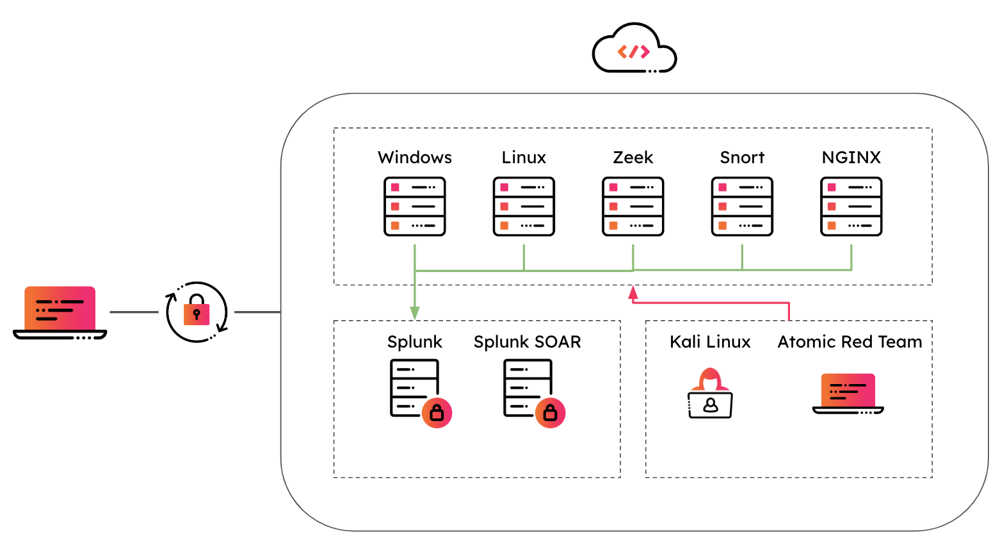

# Splunk Attack Range v5


The Splunk Attack Range builds instrumented cloud environments (AWS, Azure, GCP), simulates attacks, and forwards data into Splunk for detection development and testing.



**What it does:**

- **Build labs** — Deploy a small, production-like lab (Splunk, Windows/Linux servers, optional Kali, Zeek, etc.) via Terraform and Ansible.
- **Simulate attacks** — Run Atomic Red Team (and other) techniques to generate real telemetry.
- **Share access** — Use WireGuard VPN; generate additional client configs to share the range with others.

**Click the picture to watch the demo 👇**  

<a href="https://youtu.be/FkDiiYGKjKg" target="_blank">
  
</a>

---

## Getting started

**Preferred: Docker Compose**

1. **Prerequisites:** [Docker](https://docs.docker.com/get-docker/) and [Docker Compose](https://docs.docker.com/compose/install/). Configure your cloud provider (AWS, Azure, or GCP) and mount credentials as below.

2. **Clone and start:**

   ```bash
   git clone https://github.com/splunk/attack_range
   cd attack_range
   docker compose -f docker/docker-compose.yml build --no-cache
   docker compose -f docker/docker-compose.yml up
   ```

3. **Use the app or API:**

   - **Web app:** open [http://localhost:4321](http://localhost:4321) — build/destroy ranges, view status, run simulations, share access.
   - **API:** [http://localhost:4000](http://localhost:4000) — REST API; interactive docs at [http://localhost:4000/openapi/swagger](http://localhost:4000/openapi/swagger).

4. **Build a range (two steps):**

   - In the app: pick a template (e.g. `aws/splunk_minimal_aws`) and start the build. When status is *Waiting for VPN*, download the WireGuard config, connect with WireGuard, then continue the build.
   - Or via API: `POST /attack-range/build` with `{"template": "aws/splunk_minimal_aws"}`, poll `GET /attack-range/status/<id>`, use the returned WireGuard config, connect, then `POST /attack-range/build` with `{"attack_range_id": "<id>"}`.

5. **CLI in Docker (optional):**

   ```bash
   docker compose --profile cli -f docker/docker-compose.yml run --rm attack_range build -t aws/splunk_minimal_aws
   ```

   Other actions: `destroy`, `simulate`, `share`. See [Detailed documentation](https://attack-range.readthedocs.io/en/latest/) for CLI usage and flags.

---

## Ways to run

| Method | Use case |
|--------|----------|
| **Docker Compose** (recommended) | Run API + web app + optional CLI with one `docker compose`; no local Python/Ansible/Terraform. |
| **Web app** | Build, destroy, simulate, and share via the UI at port 4321. |
| **REST API** | Automate from scripts or CI; full OpenAPI docs at `/openapi/swagger`. |
| **CLI** | `attack_range.py build \| destroy \| simulate \| share` for terminal-based workflows. |

---

## Documentation

- **Full docs (Read the Docs):** [https://attack-range.readthedocs.io/](https://attack-range.readthedocs.io/en/latest/)
- Chapters:
  - [Getting Started](https://attack-range.readthedocs.io/en/latest/getting-started.html)
  - [Configuration](https://attack-range.readthedocs.io/en/latest/configuration.html)
  - [Networking](https://attack-range.readthedocs.io/en/latest/networking.html)
  - [Sharing](https://attack-range.readthedocs.io/en/latest/sharing.html)
  - [Templates](https://attack-range.readthedocs.io/en/latest/templates.html)
  - [Ansible Roles](https://attack-range.readthedocs.io/en/latest/ansible-roles.html)

---

## Quick reference

- **Configs:** Each range has a config in `config/<attack_range_id>.yml`. Templates live in `templates/{aws,azure,gcp}/`.
- **Credentials:** Set up `~/.aws`, `~/.azure`, or `~/.config/gcloud` and mount them into the containers (see `docker/docker-compose.yml`).
- **Support:** [GitHub issues](https://github.com/splunk/attack_range/issues) and [CONTRIBUTING](docs/CONTRIBUTING.md).

---

## Support

Please use the [GitHub issue tracker](https://github.com/splunk/attack_range/issues) to submit bugs or request features.

If you have questions or need support, you can:

* Join the [#security-research](https://splunk-usergroups.slack.com/archives/C1S5BEF38) room in the [Splunk Slack channel](http://splunk-usergroups.slack.com)
* Post a question to [Splunk Answers](http://answers.splunk.com)
* If you are a Splunk Enterprise customer with a valid support entitlement contract and have a Splunk-related question, you can also open a support case on the https://www.splunk.com/ support portal

---

## Contributing

We welcome feedback and contributions from the community! Please see our [contribution guidelines](docs/CONTRIBUTING.md) for more information on how to get involved.

---

## Author(s)

* [Jose Hernandez](https://twitter.com/_josehelps)
* [Patrick Bareiß](https://twitter.com/bareiss_patrick)

## Contributors

* [Bhavin Patel](https://twitter.com/hackpsy)
* [Rod Soto](https://twitter.com/rodsoto)
* Russ Nolen
* Phil Royer
* [Joseph Zadeh](https://twitter.com/JosephZadeh)
* Rico Valdez
* [Dimitris Lambrou](https://twitter.com/etz69)
* [Dave Herrald](https://twitter.com/daveherrald)
* Ignacio Bermudez Corrales
* Peter Gael
* Josef Kuepker
* Shannon Davis
* [Mauricio Velazco](https://twitter.com/mvelazco)
* [Teoderick Contreras](https://twitter.com/tccontre18)
* [Lou Stella](https://twitter.com/ljstella)
* [Christian Cloutier](https://github.com/ccl0utier)
* Eric McGinnis
* [Micheal Haag](https://twitter.com/M_haggis)
* Gowthamaraj Rajendran
* [Christopher Caldwell](https://github.com/cudgel)
* [Zachary Christensen](https://github.com/ZachTheSplunker)
* [JerinSaji0](https://github.com/JerinSaji0)
* [Michal Cichorz](https://github.com/cichyx96)